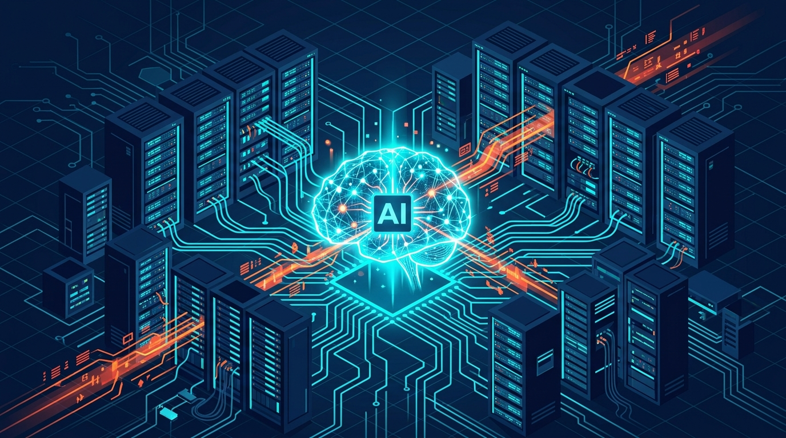

# Meta and Microsoft's Adoption of Claude AI

In a surprising strategic shift, tech giants Meta and Microsoft are increasingly integrating Anthropic's Claude AI into their enterprise workflows and product ecosystems, diversifying their artificial intelligence portfolios beyond proprietary models.\n\nOur latest industry analysis explores the technical implications of this multi-model strategy, how Claude's unique architectural strengths are being leveraged in secure corporate environments, and what this means for the broader competitive landscape of enterprise AI.\n\nRead the full strategic breakdown on our official tech portal.

**[Read the full technical breakdown here](https://cyberupdates365.com/meta-microsoft-claude-ai-use/)**

---
*Maintained by Kiran Sonawane | Senior Cloud & DevOps Engineer*
